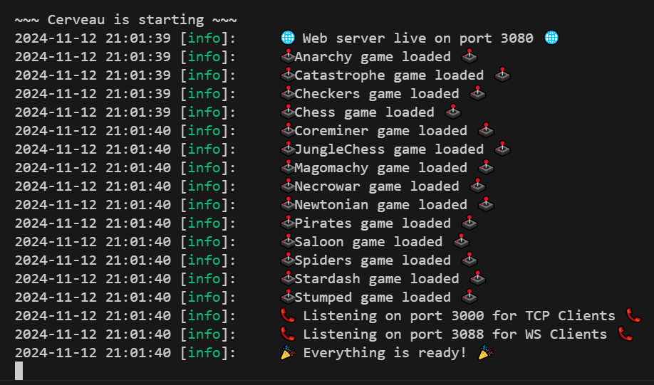
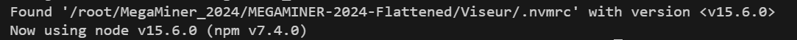
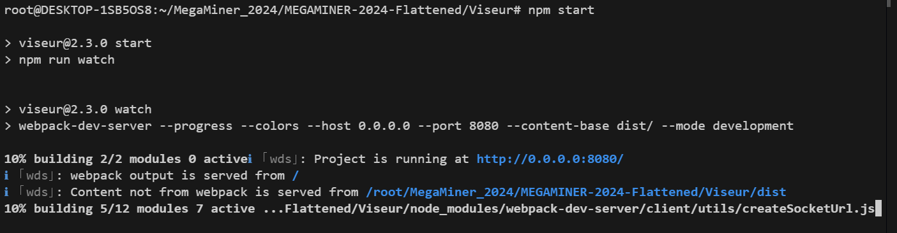

# Installation of the Repository

## Introduction

This game uses the Flattened version of the siggame repository, therefore it works a bit differently. There are a series of steps you must follow to make sure you can run the repository and test your AI's.

### Step 0. Making sure you have the right environment.

Of course, make sure you have the corresponding language you are coding in for your AI's. 
Have Javascript as well as Node.js installed. 
Be sure you are able to use npm and nvm as they are necessary for this setup.

### Step 1. Going into Cerveau.

First step is to `cd` into the Cerveau folder in the terminal. Once you are in the folder, run `npm install`.
Once it runs, type in `npm run build` and then `npm start`. If you get this screen: 

Then you are good to go!

### Step 2. Going to Viseur.

Second step is to `cd ..` out from Cerveau and then `cd` into the Viseur folder. When you in the folder within the terminal, run `npm install`. 

Afterwards, or if that doesn't work, run `npm install --legacy-peer-deps` and it should able the visualizer to work as intended.

Then, run `nvm use` to get the right node.js version. When ran, it should look liked this:

Afterwards, if you run `npm start`, and it starts building, then you should be good to go.

Click on where it says http://0.0.0.0:8080/ to go to the browser. Note: This link does not work, you have to use the one in the picture when you build the Visualizer.

## Conclusion.

So, that is how you set up the environment. If you are a competitor, make sure to only edit the ai files in the respective Joueur folder. If you are developer, this should get you started on editing and testing your game.

